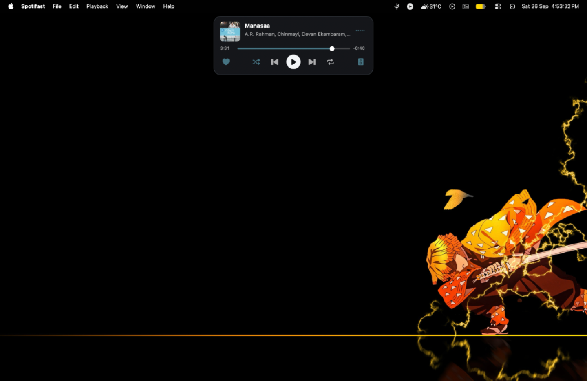
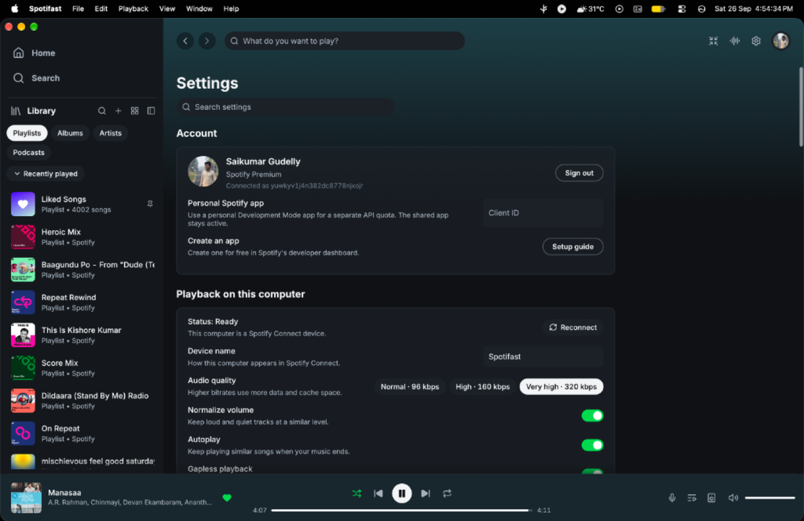
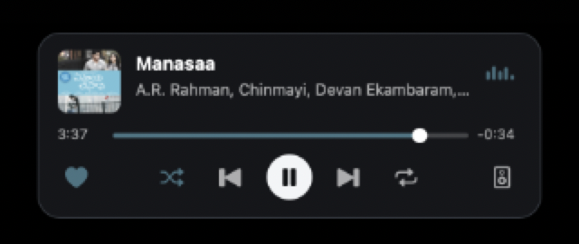

# MacBook notch widget visual review

Native macOS captures on Apple Silicon M2 with hardware camera notch (macOS Sequoia) comparing `main` baseline with the `feature/mac-notch-widget` candidate branch.

Open `review.html` in any browser to inspect the matching captures with the Theme (Dark / Light), Window size (Normal / Narrow), and Revision (Before / After) controls.

## Visible Scope & Spotifast Design System Alignment

- **Seek Bar:** 4pt seek bar matching Spotifast's own `thin_slider` (shape, height, colors, and 6pt radius solid white thumb handle) rather than an uncharacteristic wavy/Material design.
- **Card Controls & Styling:**
  - 36pt white circular disc button (`theme::circle_button`) for Play/Pause.
  - Heart Liked Songs button, Hi-Fi speaker for Spotify Connect targets, next, previous, shuffle, and repeat toggles.
  - 18pt corner radius and 1px outline border matching Spotifast floating modals.
- **Resource Gating:** FFT analysis and audio tapping are conditionally executed only when the widget is expanded, the main window is backgrounded, playback is active, and audio is local PCM (zero CPU overhead when collapsed).
- **Post-Equalizer Audio Contract:** Visualizer mirrors post-EQ, pre-volume audio as mandated in `AGENTS.md`.

## Interaction States

| State | Preview | Description |
|-------|---------|-------------|
| **Active Playback** |  | Active playback with Spotifast `thin_slider` seek bar and post-EQ visualizer. |
| **Paused** |  | Paused playback with frozen playhead and play disc glyph. |
| **Collapsed** |  | Concealed under the notch when the main window is focused. |
| **Detail Crop** |  | Expanded card detail showing album artwork, typography, and controls. |
