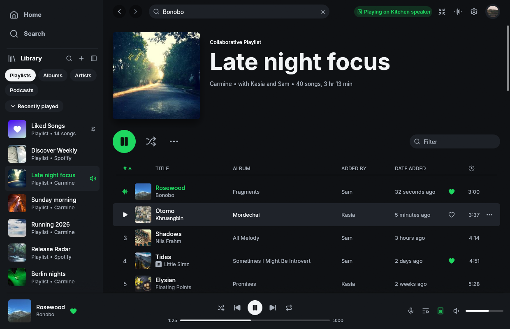
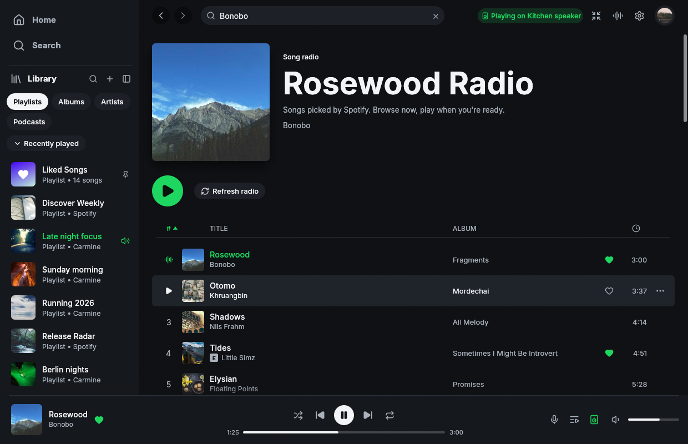
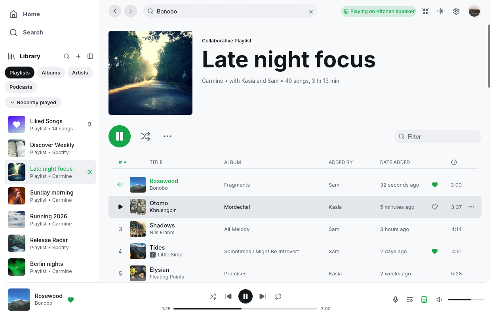
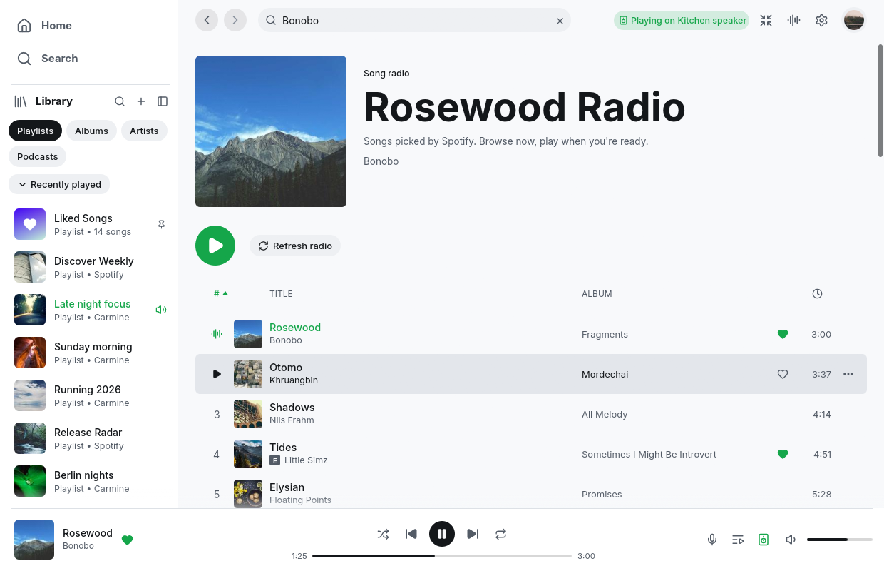
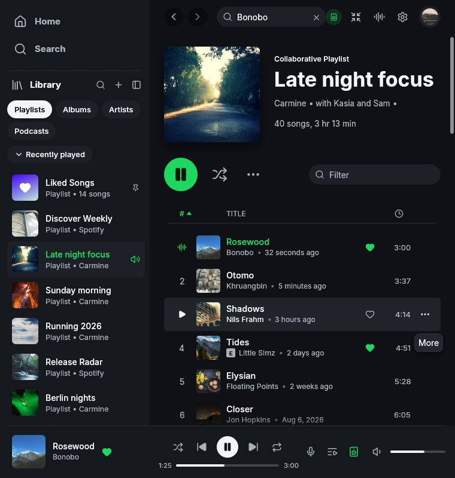
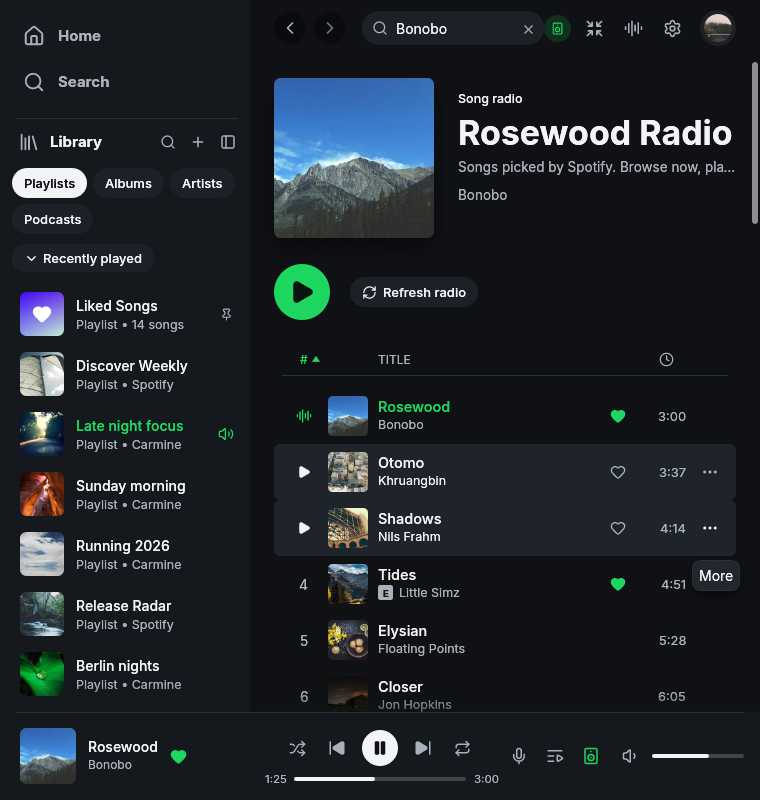
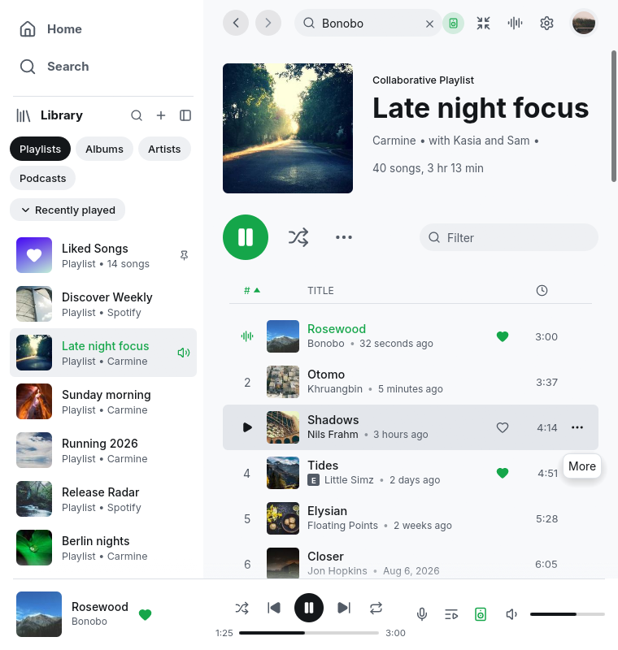
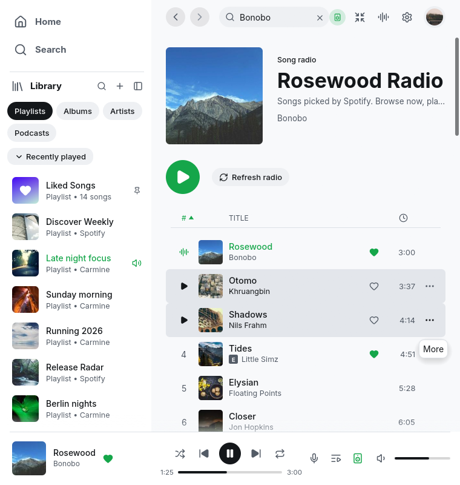

# Song-radio browsing evidence

Baseline: upstream main `a65e85c`. Candidate: the scoped radio browsing change in this directory's commit.

Screenshots use Linux demo mode with isolated empty configuration and state, at
1240x800 and 760x800 in light and dark themes. The baseline shows the playlist
from which a song is selected; the candidate shows its separate radio page.
The playback bar remains on Rosewood. Demo mode makes no Spotify requests.

| Theme and size | Before | After |
| --- | --- | --- |
| Dark, 1240x800 |  |  |
| Light, 1240x800 |  |  |
| Dark, 760x800 |  |  |
| Light, 760x800 |  |  |

Reproduce with an isolated X11 display and the corresponding binary:

```sh
spotifast --demo --demo-data /tmp/isolated-radio-demo \
  --demo-page radio:trk0 --demo-show light --demo-size 760x800 \
  --demo-shot /tmp/radio-light.png --demo-shot-delay 2000
```

Use `--demo-page playlist:pl1` for the baseline. Use a fresh `--demo-data`
directory per capture. These images verify layout, not authenticated Spotify
resolution or playback. UI regression tests separately exercise the menu,
play/refresh actions, loading artwork, navigation, and stale responses.
